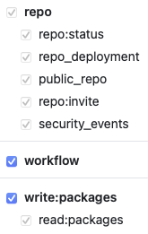

Read section about GitHub authentication on [npm @semantic-release/github](https://www.npmjs.com/package/@semantic-release/github).

## tl;dr:

Using the GITHUB_TOKEN works, __but__ it won't trigger any following Workflows. You can still use this if your only goal is to provide a downloadable zip file as GitHub Release.

If you want to trigger a following Workflow, you need to issue a Personal Access Token and specify this as Secret for the Action to use. In this case the `permissions` section in YAML is still needed (for some reason - I thought the job would be able to push to the repo because the PAT has sufficient rights, but apparently there is some additional twist).

Permissions for a Personal Access Token (classic) must be at least:

For a _Fine-grained personal access token_ use the same permissions as in the YAML file.

## Clean Testing

For clean testing, re-create the Repository on GitHub when it gets to polluted with Tags and Releases:

    gh repo delete --yes
    gh repo create --public ${${$(git remote get-url origin)##*/}%.git}
    gh secret set PERSONAL_ACCESS_TOKEN --body '<TOKEN>'

    git tag | xargs git tag -d
    git push -u origin master

# Links

- https://github.com/orgs/community/discussions/55906
- https://docs.github.com/en/actions/security-for-github-actions/security-guides/automatic-token-authentication#using-the-github_token-in-a-workflow
